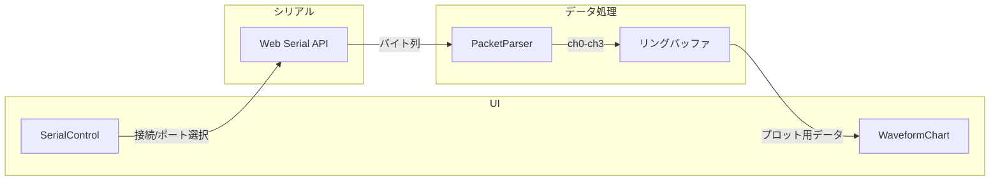

# アーキテクチャ・設計ドキュメント

本ドキュメントは、シリアル波形表示ツールの設計・拡張時の参照用です。

## 概要

- 1 ページの SPA で、Web Serial API により COM ポートと通信し、受信したバイト列をパースして uPlot で波形表示する。
- パケットフォーマットやチャンネル数は定数・型で定義し、後から拡張・改変しやすい構造にする。

## アプリ全体像

データの流れ:

1. **SerialControl** … ユーザーが Refresh → ポート選択 → ボーレート選択 → Connect。Web Serial API でポートを開く。
2. **Web Serial API** … データが来るたびにバイト列をアプリに渡す（イベント駆動）。
3. **PacketParser** … 16byte を ch0〜ch3（各 32bit unsigned、リトルエンディアン）にパース。
4. **リングバッファ** … 横軸 20 point 分を保持。新しいデータで古いデータを押し出し。
5. **WaveformChart** … uPlot で波形を描画。チャンネルごとの表示/非表示はトグルで切り替え。

## 画面・UI 構成

### シリアル通信エリア

左から次の順で配置する: **Refresh** → **COMポート一覧** → **Baudrate** → **Connect/Disconnect** → **Start/Stop**。

- **Refresh** … COM ポート一覧を再取得し、プルダウンを更新する。
- **ポートを追加** … 初回や別ポートを使うときに `requestPort()` でユーザーにポートを選択させ、一覧に追加する。
- **COMポート一覧** … 接続可能なポートをプルダウンで表示し、1 つを選択する。
- **Baudrate** … よく使う値（9600, 19200, 38400, 57600, 115200 等）をプルダウンで選択する。
- **Connect / Disconnect** … トグルで接続・切断を切り替える。
- **Start / Stop** … シリアル相手に信号を送る用のボタン。UI のみ用意し、処理は未実装。
- **エラー・状態** … 接続エラー・切断時などは、シリアル設定エリアにインラインで常時表示する。

### グラフエリア

- uPlot による波形表示。
- ch0〜ch3 をプロットし、各チャンネルの表示/非表示はトグルで切り替える。

## シリアル通信

- **前提** … Web Serial API を使用する。対応ブラウザは Chrome/Edge 等に限定される。
- **ポート一覧** … ユーザーが Refresh を押したときに `navigator.serial.getPorts()` で既に許可したポート一覧を取得。初回や別ポートを使うときは「ポートを追加」で `navigator.serial.requestPort()` を呼び、ユーザーに選択させて一覧に追加する。設定の永続化は行わず、毎回選択する。
- **接続/切断** … 選択したポートとボーレートで `port.open()`、切断時は `port.close()`。
- **受信** … データが来るたびにイベント駆動で処理する。読み取りストリームからバイト列を受け取り、内部バッファに蓄積する。**16byte 分がたまったタイミングでのみ**パースして ch0〜ch3 を更新する。それ未満の場合はバッファに保持し、次回受信と結合する。
- **ボーレート** … 9600, 19200, 38400, 57600, 115200 等のよく使う値をプルダウンで提供する。

## データ構造（拡張・改変しやすい設計）

### パケットフォーマット

- **1 パケット = 16 byte**
- 先頭 4byte → ch0、次の 4byte → ch1、その次 4byte → ch2、最後 4byte → ch3。
- 各チャンネルは **32bit unsigned**、**リトルエンディアン**で固定。

バイト配置のイメージ:

| オフセット | サイズ | 内容   |
|-----------|--------|--------|
| 0         | 4      | ch0    |
| 4         | 4      | ch1    |
| 8         | 4      | ch2    |
| 12        | 4      | ch3    |

### 拡張性

- チャンネル数やバイト配置を後から変えやすいよう、**パケットフォーマットを型・定数で定義**し、パーサーはその定義に従う。
- 例: チャンネル数（`CHANNEL_COUNT`）や 1 チャンネルあたりのバイト数（`BYTES_PER_CHANNEL`）を定数化し、パーサーはそれを使ってスライスする。フォーマット変更時は定数と型だけを修正すればよいようにする。

## グラフ仕様

- **ライブラリ** … uPlot
- **横軸** … point（インデックス）。バッファサイズは **20**。新しいデータが来たら追加し、古いデータは捨てる（リングバッファ的な動作）。
- **縦軸** … count。32bit unsigned を想定。
- **スケール**
  - 縦軸の min / max を定数で設定可能にする。
  - **auto scale 機能**を設け、表示中のデータ範囲に合わせて縦軸を自動調整できるようにする。
- **表示** … ch0〜ch3 を波形としてプロット。各チャンネルの表示/非表示はトグルで切り替える。

## コンポーネント・責務の目安

| コンポーネント/モジュール | 責務 |
|---------------------------|------|
| **SerialControl**         | ポート一覧取得・選択、ボーレート選択、Connect/Disconnect トグル、エラー/状態のインライン表示 |
| **PacketParser**          | 16byte バイト列を ch0〜ch3（32bit unsigned）にパース |
| **WaveformChart**         | uPlot のラップ、20 point のバッファ管理、チャンネル表示トグル、auto scale |
| **App**                   | シリアル接続状態・受信データなどの状態を保持し、上記コンポーネントに渡す |

### ファイル配置（推奨）

- `src/components/` … SerialControl, WaveformChart 等の UI コンポーネント
- `src/lib/serial/` … Web Serial API のラップ、ポート取得・接続ロジック
- `src/lib/packet/` … パケットフォーマットの定数・型、PacketParser

実装時に都合に合わせて調整してよい。

## エラー・状態表示

- 接続エラー・切断時は、モーダルやトーストではなく、**シリアル設定エリアにインラインで常時表示**する。
- ユーザーがポート選択や再接続の判断をしやすいようにする。

## デプロイ・制約

- **GitHub Pages**（HTTPS）でデプロイする想定。HTTPS であれば Web Serial API は利用可能。
- Web Serial は **Chrome/Edge などの対応ブラウザでのみ利用可能**であるため、README および本ドキュメントで「対応ブラウザ」を明記する。
